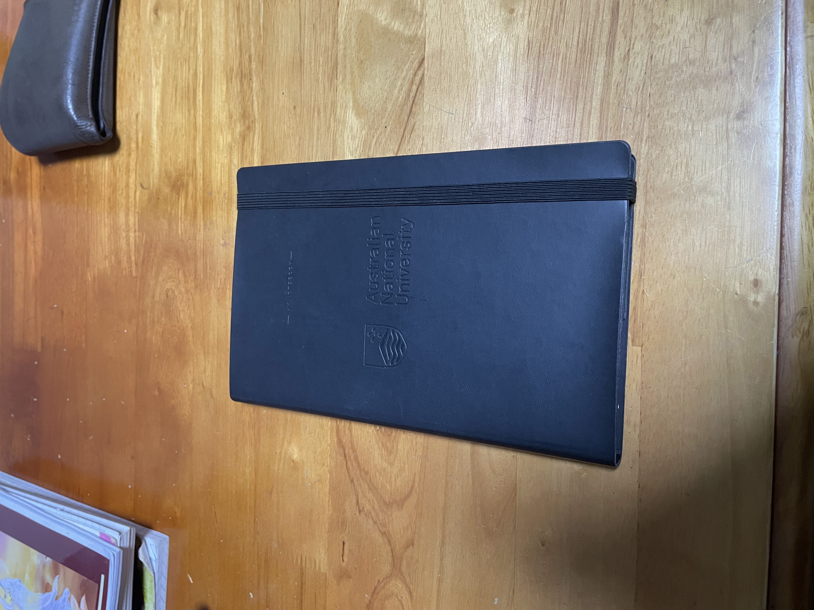
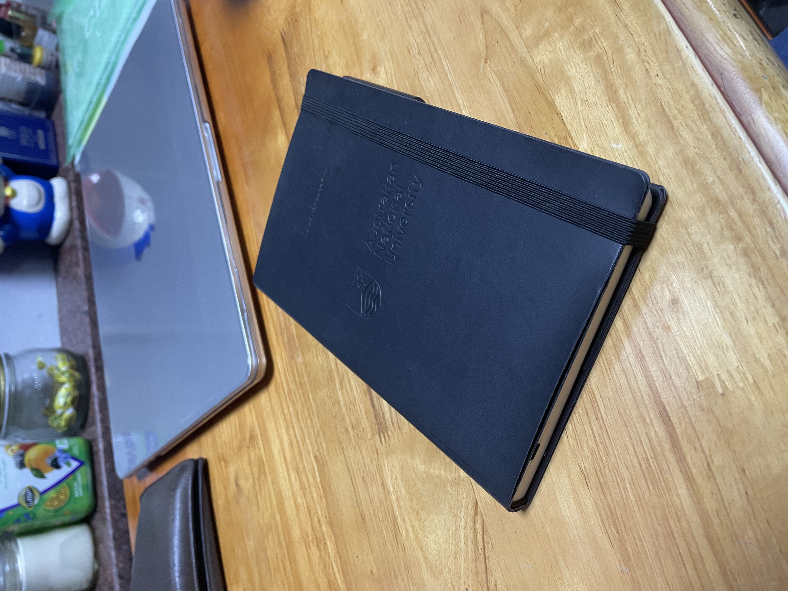
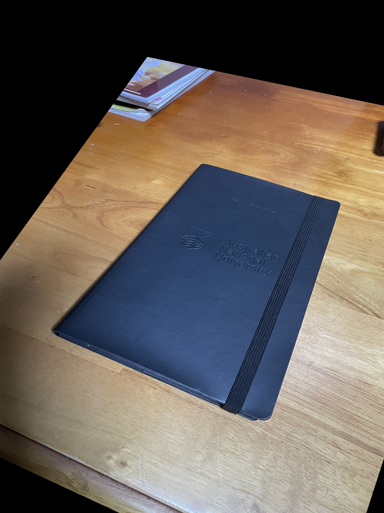

# OpenCV Robust Homography Estimation

## About
This project demonstrates robust homography estimation using OpenCV's `findHomography` function with the RANSAC algorithm. The script estimates the homography matrix between two images based on a fixed set of corresponding points. 

It also demonstrates how to warp one image to align with another using the computed homography matrix.

## Features
- Load two images.
- Define corresponding points between the images.
- Compute the homography matrix robustly using RANSAC.
- Warp one image to align it with the other.
- Display the original and warped images for comparison.

## Requirements
- Python 3.7+
- OpenCV (`opencv-python`)

Install OpenCV using pip:
```bash
pip install opencv-python
```

## Usage
1. **Set Image Paths**:
   Update the `image1_path` and `image2_path` variables in the script to point to your images.

2. **Define Corresponding Points**:
   Modify `points_img1` and `points_img2` in the script to include matching points from the two images in `[x, y]` format.
   You can also use the `scripts/view_point_coordinates.py` to find these points.

3. **Run the Script**:
   Save the script as `robust_homography_estimation.py` and execute it:
   ```bash
   python scripts/robust_homography_estimation.py
   ```

4. **Output**:
   - The homography matrix is printed in the terminal.
   - The warped version of the first image is displayed alongside the original images.

## Example
### Original Images
#### Image 1:

#### Image 2:


### Warped Image
#### Image 1 Aligned to Image 2:


## How it Works
1. The user specifies a set of corresponding points in two images.
2. OpenCV's `findHomography` function calculates the transformation matrix (`H`) that maps points in the first image to corresponding points in the second image.
3. The computed homography matrix is then used with `cv2.warpPerspective` to align the first image with the second.

## Acknowledgments
This project uses OpenCV, an open-source computer vision and machine learning library. More about OpenCV can be found [here](https://opencv.org/).

### Instructions for Adding Images:
1. Save the original images as `image1.jpg` and `image2.jpg`.
2. Save the warped image generated by the script as `warped_image.jpg`.
3. Place all three images in the same directory as the README file. 

The Markdown format will automatically render the images when viewed in a Markdown viewer or on a platform like GitHub.